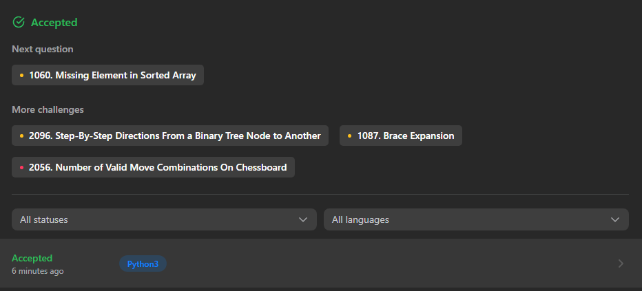
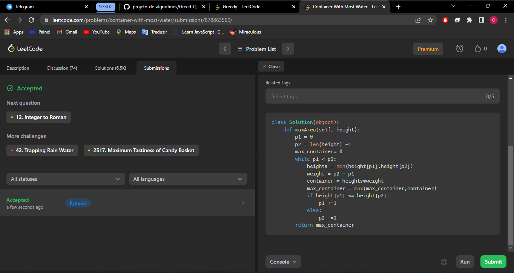
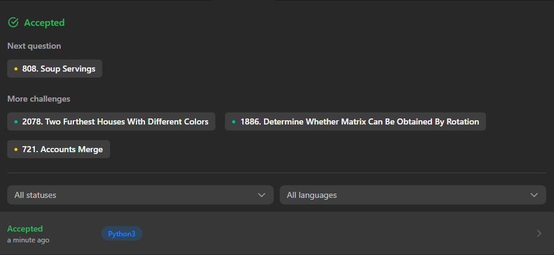
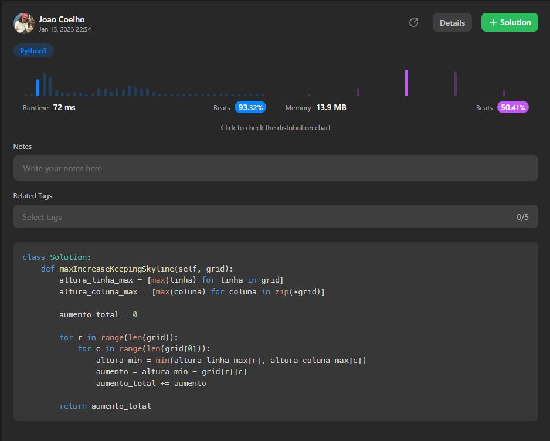
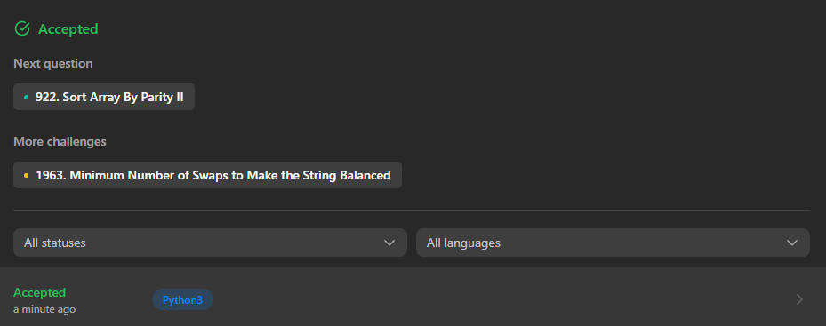
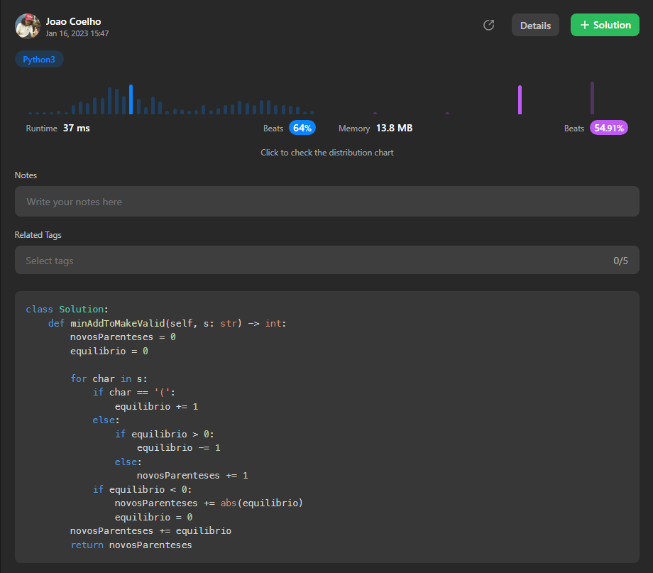

# Questões - Dupla 07

**Número da Lista**: 07 
**Conteúdo da Disciplina**: Greed 

## Alunos
|Matrícula | Aluno |
| -- | -- |
| 18/0099353  |  Cibele Freitas Goudinho |
| 16/0127327  |  João Paulo Coelho de Souza |

## Sobre 
Solução de questões sobre algoritmos gananciosos no site leetcode. 

## Screenshots
 - Solução da questão [1061. Lexicographically Smallest Equivalent String](https://leetcode.com/problems/lexicographically-smallest-equivalent-string/) em Python.  
 
 

 - Solução da questão [11. Container With Most Water](https://leetcode.com/problems/container-with-most-water/description/) em Python.  
 

- Solução da questão [807. Max Increase to Keep City Skyline](https://leetcode.com/problems/max-increase-to-keep-city-skyline/)

- Solução da questão [921. Minimum Add to Make Parentheses Valid](https://leetcode.com/problems/minimum-add-to-make-parentheses-valid/)

## Instalação 
Todos códigos foram rodados no console do site leetcode.

## Apresentação
https://user-images.githubusercontent.com/40813329/212776704-51bc5713-cd2e-42e8-a0ef-3655d5095d23.mp4

## Outros 
Quaisquer outras informações sobre seu projeto podem ser descritas abaixo.

