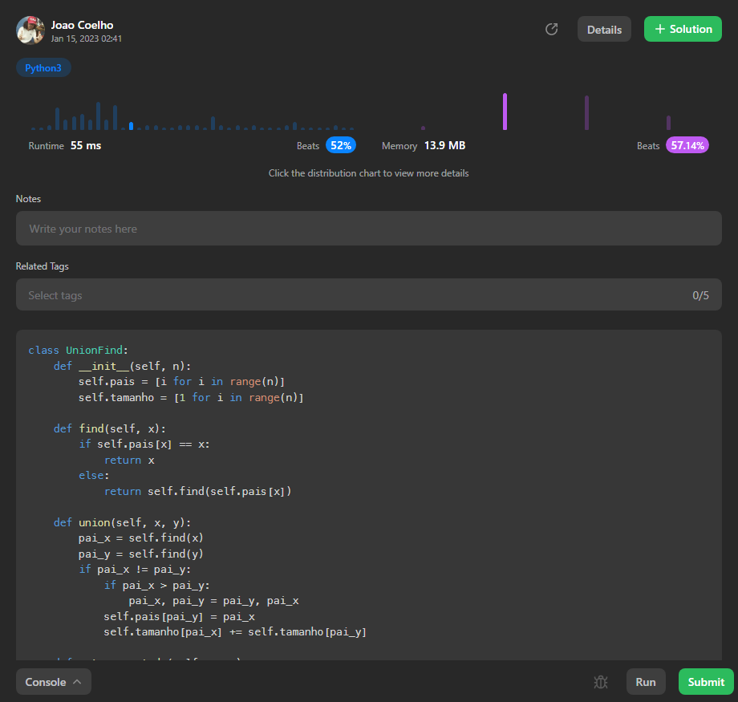
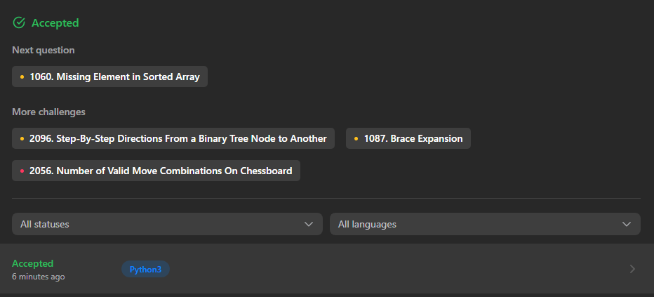

# Questões - Dupla 07

**Número da Lista**: 07 
**Conteúdo da Disciplina**: Greed 

## Alunos
|Matrícula | Aluno |
| -- | -- |
| 18/0099353  |  Cibele Freitas Goudinho |
| 16/0127327  |  João Paulo Coelho de Souza |

## Sobre 
Solução de questões sobre algoritmos gananciosos no site leetcode. 

## Screenshots
 - Solução da questão [1061. Lexicographically Smallest Equivalent String](https://leetcode.com/problems/lexicographically-smallest-equivalent-string/) em Python.  
 
 

## Instalação 
Todos códigos foram rodados no console do site leetcode.

## Outros 
Quaisquer outras informações sobre seu projeto podem ser descritas abaixo.

